# Database Administration Topic

## MySQL

### 1. Download MySQL server for your OS on VM `&&` 2. Install MySQL server on VM

```shell
$ sudo apt-get install mysql-server
$ sudo mysql_secure_installation
```

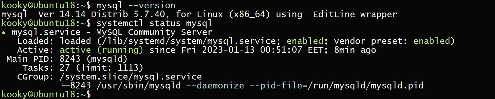

### 3. Select a subject area and describe the database schema (minimum 3 tables)

Subject area is an international food delivery service.
There are 4 tables.

1. **Orders** table

```mysql
CREATE TABLE Orders (
    OrderID int NOT NULL,
    CustomerID int NOT NULL,
    OrderDate date,
    PRIMARY KEY (OrderID),
    FOREIGN KEY (CustomerID) REFERENCES Customers (CustomerID)
);
```

|OrderID|CustomerID|OrderDate|
|---|---|---|
|10248|90|1996-07-04|
|10249|81|1996-07-05|
|10250|34|1996-07-08|
|10251|84|1996-07-08|
|10252|76|1996-07-09|

2. **Customers** table

```mysql
CREATE TABLE Customers (
   CustomerID int NOT NULL,
   ContactName varchar(255) NOT NULL,
   Address varchar(255) NOT NULL,
   City varchar(255) NOT NULL,
   Country varchar(255) NOT NULL,
   PRIMARY KEY (CustomerID)
);
```

|CustomerID|ContactName|Address|City|Country|
|---|---|---|---|---|
|34|Mario Pontes|Rua do Paço, 67|Rio de Janeiro|Brazil|
|76|Pascale Cartrain|Boulevard Tirou, 255|Charleroi|Belgium|
|81|Anabela Domingues|Av. Inês de Castro, 414|São Paulo|Brazil|
|84|Mary Saveley|2, rue du Commerce|Lyon|France|
|90|Matti Karttunen|Keskuskatu 45|Helsinki|Finland|

3. **OrderDetails** table

```mysql
CREATE TABLE OrderDetails (
   ID int NOT NULL,
   OrderID int NOT NULL,
   ProductID int NOT NULL,
   Quantity int NOT NULL,
    PRIMARY KEY (ID),
    FOREIGN KEY (OrderID) REFERENCES Orders (OrderID),
    FOREIGN KEY (ProductID) REFERENCES Products (ProductID)
);
```

|ID|OrderID|ProductID|Quantity|
|---|---|---|---|
|1| 10248|11| 12|
|2| 10248|42| 10|
|3| 10248|72|  5|
|4| 10249|14|  9|
|5| 10249|51| 40|
|6| 10250|41| 10|
|7| 10250|51| 35|
|8| 10250|65| 15|
|9| 10251|22|  6|
|10|10251|57| 15|
|11|10251|65| 20|
|12|10252|20| 40|
|13|10252|33| 25|
|14|10252|60| 40|

4. **Products** table

```mysql
CREATE TABLE Products (
ProductID int NOT NULL,
 ProductName varchar(255) NOT NULL,
 Price float(2)  NOT NULL,
 PRIMARY KEY (ProductID)
);
```

|ProductID|ProductName|Price|
|---|---|---|
|11|Queso Cabrales| 21|
|14|Tofu|23,25|
|20|Sir Rodney's Marmalade|81|
|22|Gustaf's Knäckebröd|21|
|33|Geitost|2,5|
|41|Jack's New England Clam Chowder|9,65|
|42|Singaporean Hokkien Fried Mee|14|
|51|Manjimup Dried Apples|53|
|57|Ravioli Angelo|19,5|
|60|Camembert Pierrot|34|
|65|Louisiana Fiery Hot Pepper Sauce|21,05|
|72|Mozzarella di Giovanni|34,8|

### 4. Create a database on the server through the console `&&` 5. Fill in tables

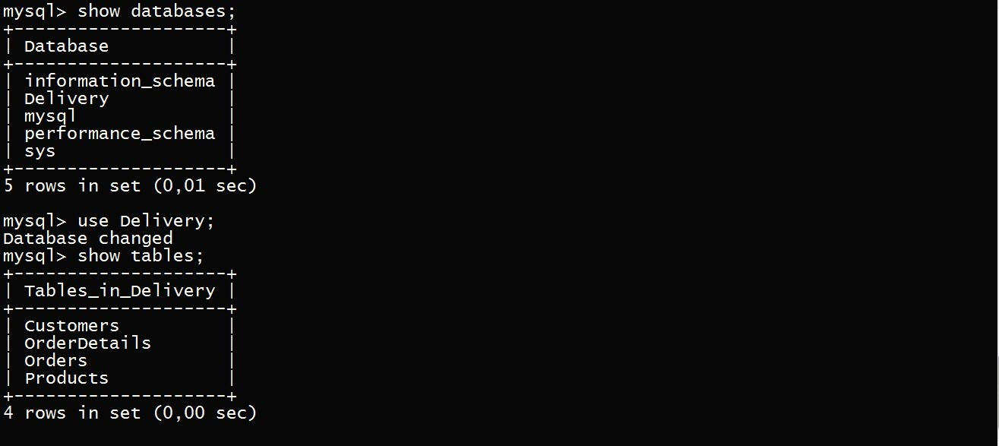

### 6. Construct and execute `SELECT` operator with `WHERE`, `GROUP BY` and `ORDER BY`

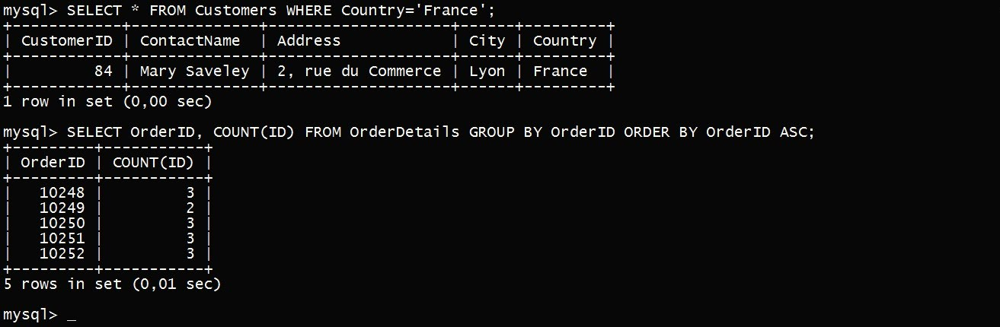

### 7. Execute other different SQL queries DDL, DML, DCL

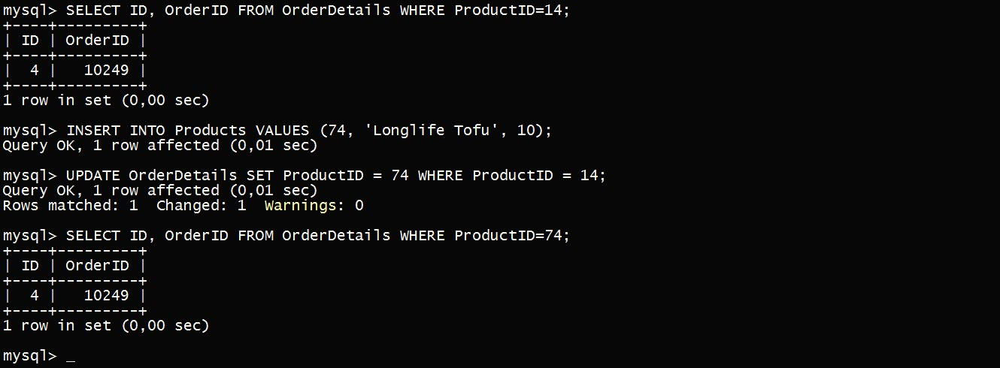

### 8. Create a database of new users with different privileges. Connect to the database as a new user and verify that the privileges allow or deny certain actions

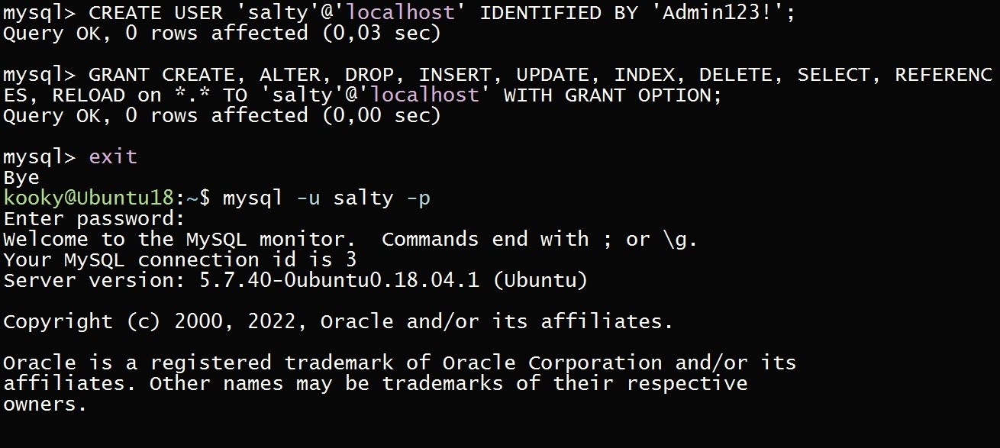

### 9. Make a selection from the main table DB MySQL

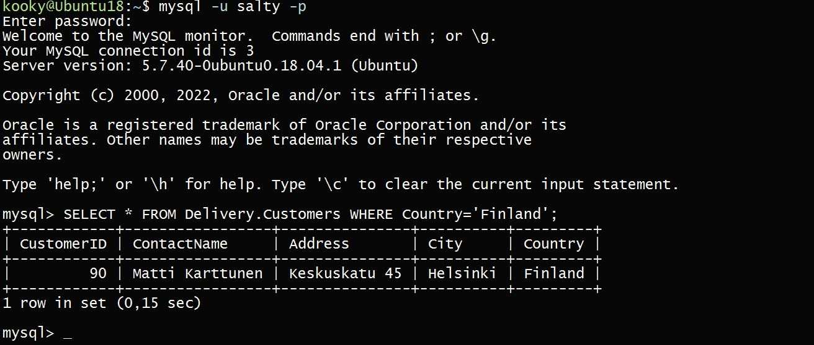

### 10.Make backup of your database `&&` 11.Delete the table and/or part of the data in the table

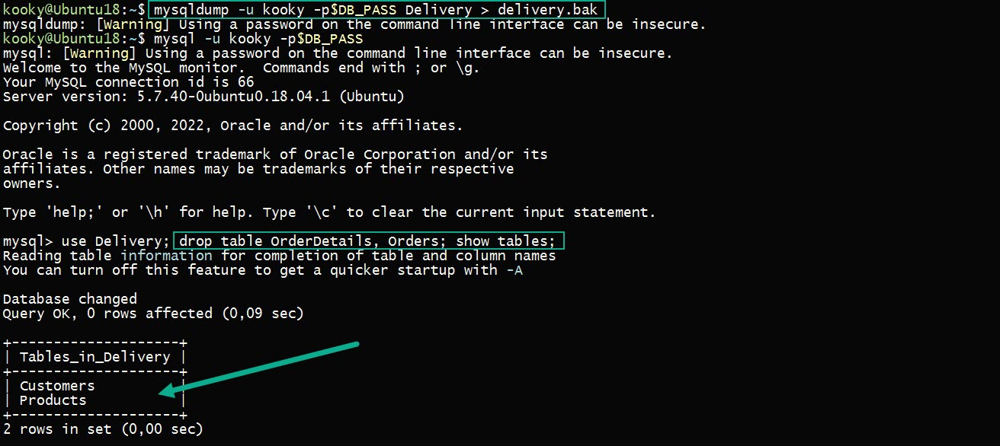

### 12.Restore your database


### 13.Transfer your local database to RDS AWS `&&` 14.Connect to your database

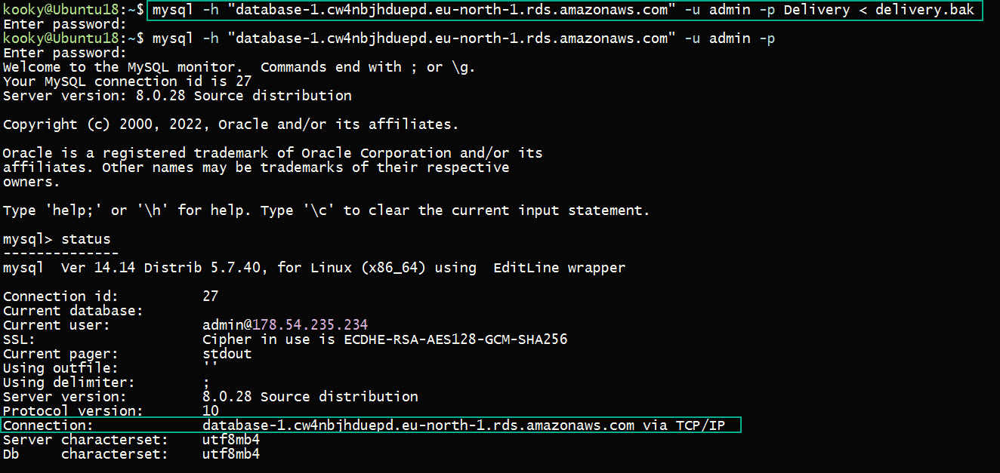

### 15.Execute `SELECT` operator similar step 6

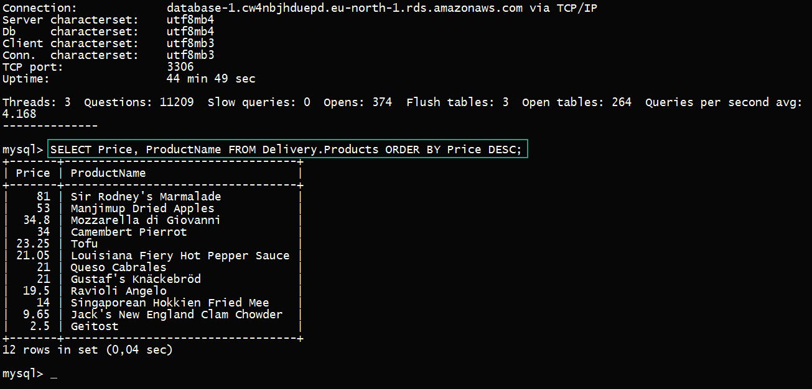

### 16.Create the dump of your database

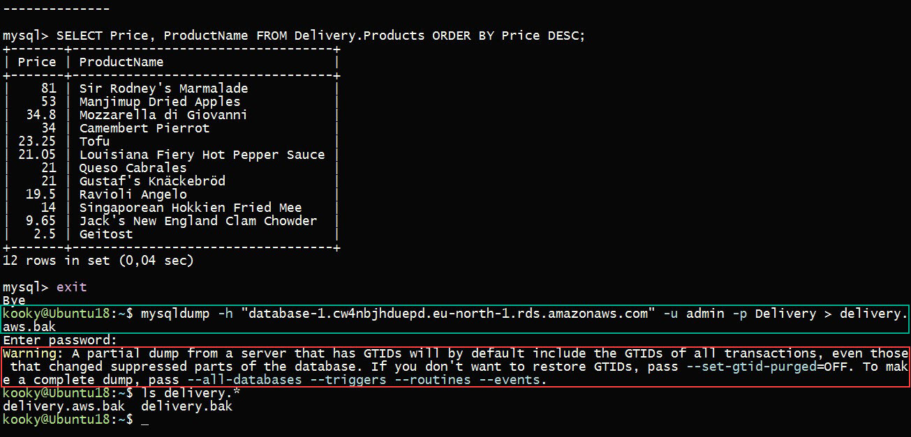

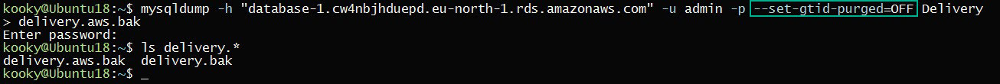

## MongoDB

### 17. Create a database. Use the `use` command to connect to a new database (If it doesn't exist, Mongo will create it when you write to it)

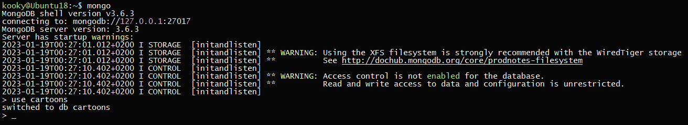

### 18. Create a collection. Use `db.createCollection` to create a collection. I'll leave the subject up to you. Run `show dbs` and `show collections` to view your database and collections

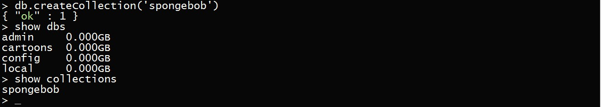

### 19. Create some documents. Insert a couple of documents into your collection. I'll leave the subject matter up to you, perhaps cars or hats

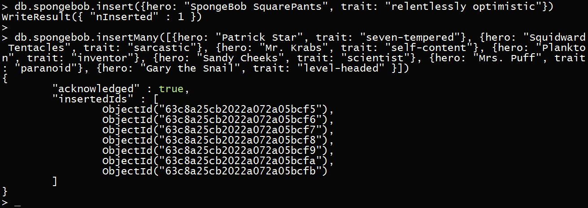

### 20. Use `find()` to list documents out

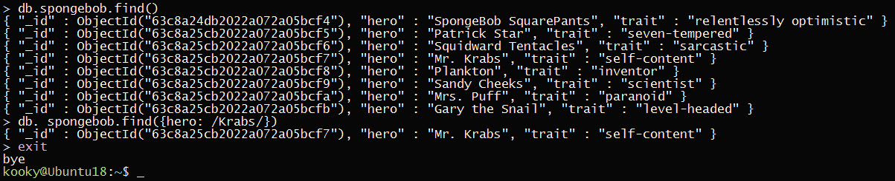
